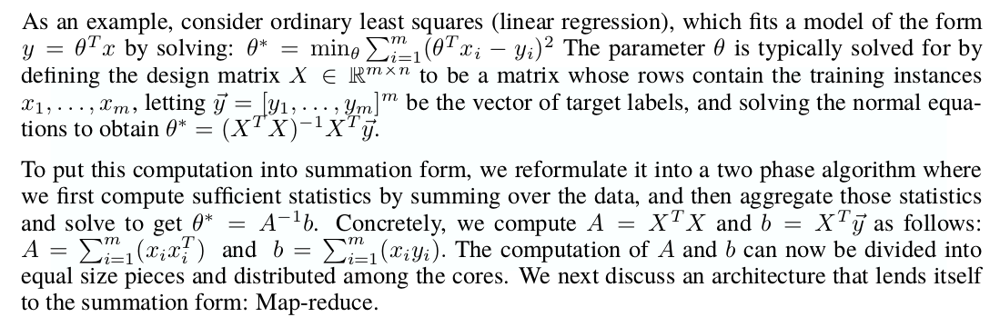

## Task 1: Data Validation with Google TFX

The goal of this task is to use [Tensorflow Data Validation](https://www.tensorflow.org/tfx/guide/tfdv) to validate two sets of data files about products and ratings in the [data](data/) folder. 

We assume that all products data files are valid except for `products-data-3.tsv`. Additionally, we assume that `ratings-2.tsv` and `ratings-3.tsv` have anomalies.

Eyeballing the data should help you identify differences between the individual files. We ask you use **tfdv**  to infer a schema from the data, adjust the schema if necessary and ensure that your code correctly identifies the files with data anomalies. Use `python task1.py` to execute this task and implement your solution in [components/schema_validation.py](components/schema_validation.py). Looking at this [test code](https://github.com/tensorflow/data-validation/blob/80809cd738fd1178f6c0334b0e4f4e644f445139/tensorflow_data_validation/anomalies/schema_test.cc) from Tensorflow might help you identify schema constraints that are helpful for this task.

## Task 2: Parallel Data Processing with Apache Beam

Next, you will have implement a parallel data preprocessing job using [Apache Beam](https://beam.apache.org). The input data consists of product descriptions in the file [products-data-0.tsv](data/products-data-0.tsv) with the schema `identifier, category, description` and of product ratings in the file [ratings-0.tsv](data/ratings-0.tsv) with the schema `identifier, rating`.

You Beam job should conduct the following operations:
  1. Conduct an equi-join on both inputs using the join key `identifier`
  1. Filter the join result to only retain records that have (a) 'Kitchen' as `category` and a `rating` of at least 4 or (b) 'Jewelry' as `category` and a `rating` of 5
  1. Group the join results by `category`
  1. Compute the number of records per group
  1. Write the categories and counts tab separated into a file `category_counts.tsv-00000-of-00001`, a line of this file could look like `Kitchen  123` for example.

Use `python task2.py` to execute this task and implement your solution in [components/beam_job.py](components/beam_job.py). 
  

## Task 3: Implement your own MapReduce Engine

In this task, you have to implement your own simple MapReduce engine. Note that instead of the typical case of implementing the functions `f_m` and `f_r` that are executed by the MapReduce engine, this task has a different setup. The functions `f_m` and `f_r` are given for a simple wordcount algorithm and you have to implement the underlying runtime that applies them to the input data, according to the MapReduce paradigm.

Use `python task3.py` to execute this task and implement your solution in [components/mapreduce.py](components/mapreduce.py). You have to implement methods to run the typical three phases of a MapReduce job: 

 1. Run the [map-phase](https://github.com/schelterlabs/deml-lab/blob/master/assignment2/components/mapreduce.py#L28): for each partition, transform each input record with `f_r`
 2. Run the [shuffle-phase](https://github.com/schelterlabs/deml-lab/blob/master/assignment2/components/mapreduce.py#L33): create as many output partitions as we have reducers, and ensure that all records with the same key are put into the same group in the same partition
 3. Run the [reduce phase](https://github.com/schelterlabs/deml-lab/blob/master/assignment2/components/mapreduce.py#L37): apply `f_r` to every group in every partition

Note that your implementation does not need to run in parallel or be efficient or be able to handle large datasets.

## Task 4: Parallel Linear Regression with MapReduce

In this final task, you will use your MapReduce engine from the previous task to implement the parallel linear regression example from [Map-Reduce for Machine Learning on Multicore](https://papers.nips.cc/paper/3150-map-reduce-for-machine-learning-on-multicore.pdf).

Here is the description of the approach:

The input data for this task is a simple regression problem generated by scikit-learn's [make_regression](https://scikit-learn.org/stable/modules/generated/sklearn.datasets.make_regression.html). Use `python task4.py` to execute this task and implement your solution in [components/linear_regression.py](components/linear_regression.py). Use the output of `result_key()` as the key for the model in the final result.
