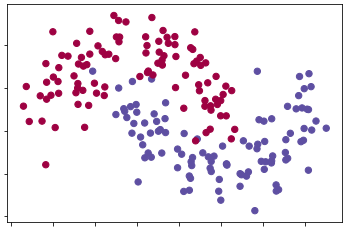
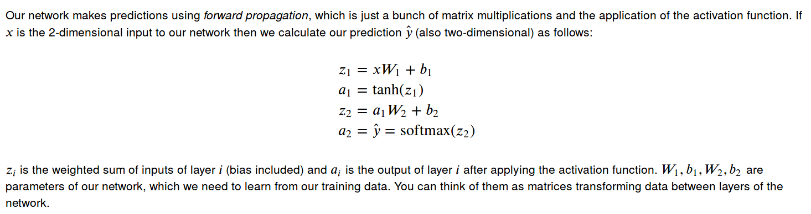
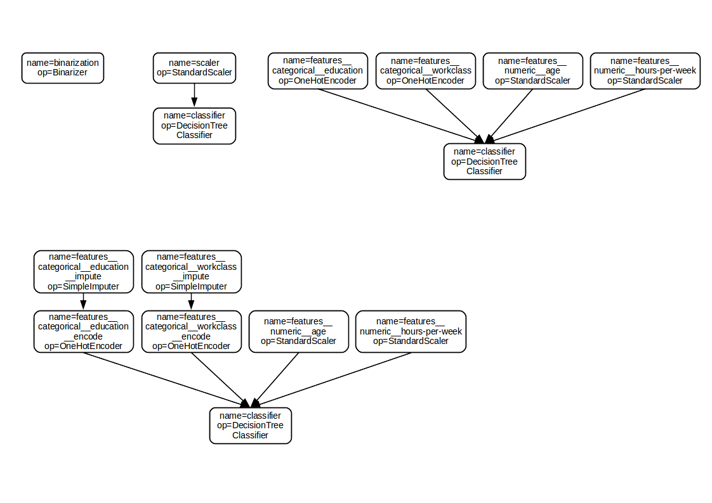

## Task 1: Implementing Layers in a Neural Network

The goal of this task is to ...

## Task 2, 3 & 4: Translating Scikit-learn Pipelines to Dataflow Graphs

In the remaining three tasks, you have to ...

